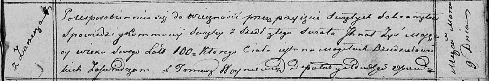

**Зыз Игнат (Zyz, Zys Jhnat)**

4 июля 1783 г -- крещение дочери Юстыны (РГИА 823-2-18, лист 224об,
№19/1783-р (коп)).

9 марта 1820 г -- отпевание, умер в возрасте 100 лет (родился около 1720
г) (НИАБ 136-13-919, лист 33, №3/1820-у (ориг)).

**РГИА 823-2-18:** Лист 224об. **Метрическая запись №19/1783-р (коп).**

{width="6.496527777777778in"
height="1.6875in"}

Дедиловичская Покровская церковь. 4 июля 1783 года. Метрическая запись о
крещении.

Zyzowna Justyna -- дочь родителей с деревни Заречье.

Zyz Jhnat -- отец.

Zyzowa Xienia -- мать.

Słabowski Chwiedor -- кум.

Sawiczowa Ewdokia - кума.

Jazgunowicz Antoni -- ксёндз.

**НИАБ 136-13-919:** Лист 33. **Метрическая запись №3/1820-у (ориг).**

{width="6.496527777777778in"
height="1.0805555555555555in"}

Осовская униатская церковь. 9 марта 1820 года. Метрическая запись об
отпевании.

Zyś Jhnat -- умерший, 100 лет, с деревни Заречье, похоронен на кладбище
деревни Дедиловичи.

Woyniewicz Tomasz -- ксёндз.
