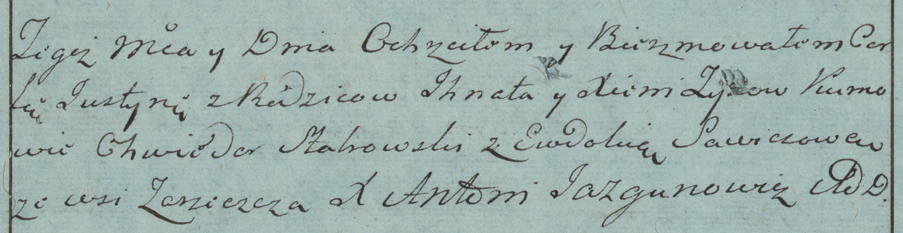
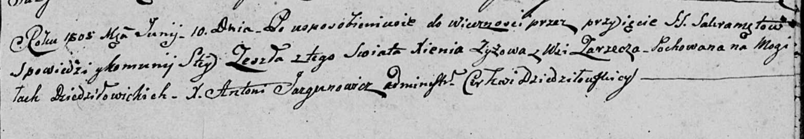

**Зыз Ксеня (Zyzowa Xienia)**

4 июля 1783 г -- крещение дочери Юстыны (РГИА 823-2-18, лист 224об,
№19/1783-р (коп)).

10 июня 1805 г -- отпевание (НИАБ 136-13-919, лист 16, №7/1805-у (коп)).

**РГИА 823-2-18:** Лист 224об. **Метрическая запись №19/1783-р (коп).**

Дедиловичская Покровская церковь. 4 июля 1783 года. Метрическая запись о
крещении.

Zyzowna Justyna -- дочь родителей с деревни Заречье.

Zyz Jhnat -- отец.

Zyzowa Xienia -- мать.

Słabowski Chwiedor -- кум.

Sawiczowa Ewdokia - кума.

Jazgunowicz Antoni -- ксёндз.

**НИАБ 136-13-919:** Лист 16. **Метрическая запись №7/1805-у (ориг).**

Дедиловичская Покровская церковь. 10 июня 1805 года. Метрическая запись
об отпевании.

Zyzowa Xienia -- умершая, с деревни Заречье, похоронена на кладбище
деревни Дедиловичи.

Jazgunowicz Antoni -- ксёндз.
