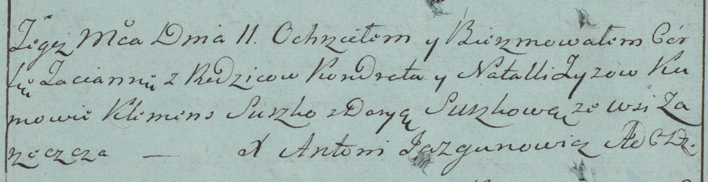

**Зыз Наталья (Zyz Natalla)**

11 января 1784 г -- крещение дочери Татьяны (РГИА 823-2-18, лист 225об,
№2/1784-р (коп)).

**РГИА 823-2-18:** Лист 225об. **Метрическая запись №2/1784-р (коп).**

{width="6.496527777777778in"
height="1.6722222222222223in"}

Дедиловичская Покровская церковь. 11 января 1784 года. Метрическая
запись о крещении.

Zyzowna Tacianna -- дочь родителей с деревни Заречье.

Zyz Kondrat -- отец.

Zyzowa Natalla -- мать.

Suszko Klemens -- кум.

Suszkowa Darya - кума.

Jazgunowicz Antoni -- ксёндз.
