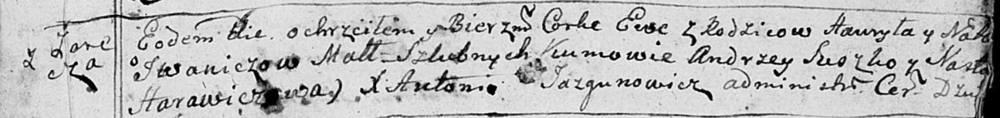

**Иванич Гаврыла (Jwanicz Hawryła)**

15 января 1792 г -- крещение дочери Евы (НИАБ 136-13-894, лист 15,
№4/1792-р (ориг)).

**НИАБ 136-13-894:** Лист 15. **Метрическая запись №4/1792-р (ориг).**

{width="6.496527777777778in"
height="0.7697408136482939in"}

Дедиловичская Покровская церковь. 15 января 1792 года. Метрическая
запись о крещении.

Jwaniczowna Ewa -- дочь родителей с деревни Заречье.

Jwanicz Hauryła -- отец.

Jwaniczowa Nasta -- мать.

Suszko Andrzey -- кум.

Harawiczowa Nasta - кума.

Jazgunowicz Antoni -- ксёндз.
