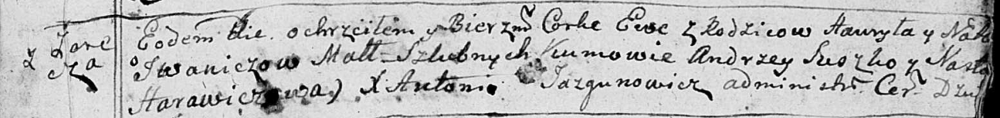

**Иванич Ева Гаврылова (Jwaniczowna Ewa)**

15 января 1792 г -- крещение (НИАБ 136-13-894, лист 15, №4/1792-р
(ориг)).

**НИАБ 136-13-894:** Лист 15. **Метрическая запись №4/1792-р (ориг).**

Дедиловичская Покровская церковь. 15 января 1792 года. Метрическая
запись о крещении.

Jwaniczowna Ewa -- дочь родителей с деревни Заречье.

Jwanicz Hauryła -- отец.

Jwaniczowa Nasta -- мать.

Suszko Andrzey -- кум.

Harawiczowa Nasta - кума.

Jazgunowicz Antoni -- ксёндз.
