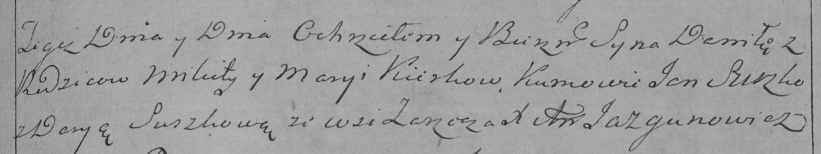

**Керко Данила Микитов (Kierko Daniła)**

18 декабря 1793 г -- крещение сына Данилы (НИАБ 136-13-894, лист 21,
№85/1793-р (ориг)), (РГИА 823-2-18, лист 249, №51/1793-р (коп)).

**НИАБ 136-13-894:** Лист 21. **Метрическая запись №85/1793-р (ориг).**

{width="6.496527777777778in"
height="0.8803740157480315in"}

Дедиловичская Покровская церковь. 18 декабря 1793 года. Метрическая
запись о крещении.

Kierko Daniła -- сын селян с деревни Заречье.

Kierko Mikita -- отец.

Kierkowa Maryia-- мать.

Suszko Jan - кум.

Suszkowa Daryia - кума.

Jazgunowicz Antoni -- ксёндз.

**РГИА 823-2-18:** Лист 249. **Метрическая запись №51/1793-р (коп).**

{width="6.496527777777778in"
height="1.21875in"}

Дедиловичская Покровская церковь. \[18\] декабря 1793 года. Метрическая
запись о крещении.

Kierko Daniło -- сын родителей с деревни Заречье.

Kierko Mikita -- отец.

Kierkowa Marya -- мать.

Suszko Jan -- кум.

Suszkowa Darya -- кума.

Jazgunowicz Antoni -- ксёндз.
