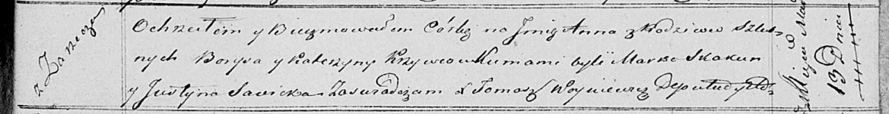

**Кривец Анна Борысова (Krywcowna Anna)**

13 марта 1821 г -- крещение (НИАБ 136-13-894, лист 106, №15/1821-р
(ориг)).

**НИАБ 136-13-894:** Лист 106. **Метрическая запись №15/1821-р (ориг).**

{width="6.496527777777778in"
height="0.8394728783902012in"}

Осовская Покровская церковь. 13 марта 1821 года. Метрическая запись о
крещении.

Krywcowna Anna -- дочь родителей с деревни Заречье.

Krywiec Borys -- отец.

Krywcowa Katerzyna -- мать.

Skakun Marko -- кум.

Savicka Justyna -- кума.

Woyniewicz Tomasz -- ксёндз.
