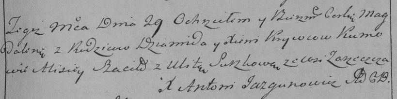

**Кривец Ксеня (Krywcowa Xienia)**

29 июня 1787 г -- крещение дочери Магдалены (НИАБ 136-13-894, лист 2,
№25/1787-р (ориг)), (РГИА 823-2-18, лист 234, №17/1787-р (коп)).

**НИАБ 136-13-894:** Лист 2. **Метрическая запись №25/1787-р (ориг).**

Дедиловичская Покровская церковь. 29 июня 1787 года. Метрическая запись
о крещении.

Krywcowna Magdalena - дочь родителей с деревни Заречье.

Kryweć Dawid? -- отец.

Krywcowa Xienia -- мать.

Szacilo Alisiej - кум.

Suszkowa Ullita - кума.

Jazgunowicz Antoniusz -- ксёндз.

**РГИА 832-2-18:** Лист 234. **Метрическая запись №17/1787-р (коп).**

Дедиловичская Покровская церковь. 29 июня 1787 года. Метрическая запись
о крещении.

Krywcowna Magdalena -- дочь родителей с деревни Заречье.

Krywiec Dziamid -- отец.

Krywcowa Xienia -- мать.

Szaciło Alisiey -- кум.

Suszkowa Ulita - кума.

Jazgunowicz Antoni -- ксёндз.
