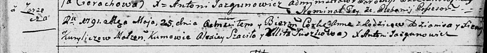
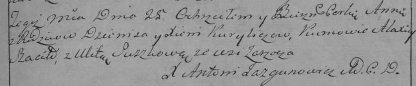

**Курилич Ксеня (Kuryliczowa Xienia)**

25 мая 1791 г -- крещение дочери Анны (НИАБ 136-13-894, лист 13,
№20/1791-р (ориг)), (РГИА 823-2-18, лист 242, №11/1791-р (коп)).

**НИАБ 136-13-894:** Лист 13. **Метрическая запись №20/1791-р (ориг).**

Дедиловичская Покровская церковь. 25 мая 1791 года. Метрическая запись о
крещении.

Kuryliczowna Anna -- дочь родителей с деревни Заречье.

Kurylicz Dzianis -- отец.

Kuryliczowa Xienia -- мать.

Szaciło Alexiey - кум.

Suszkowa Ullita - кума.

Jazgunowicz Antoni -- ксёндз.

**РГИА 823-2-18:** Лист 242. **Метрическая запись №11/1791-р (коп).**

Дедиловичская Покровская церковь. 25 мая 1791 года. Метрическая запись о
крещении.

Kuryliczowa Anna -- дочь родителей с деревни Заречье.

Kurylicz Dzienis -- отец.

Kuryliczowa Xienia -- мать.

Szaciło Alaxiey -- кум.

Suszkowa Ulita - кума.

Jazgunowicz Antoni -- ксёндз.
