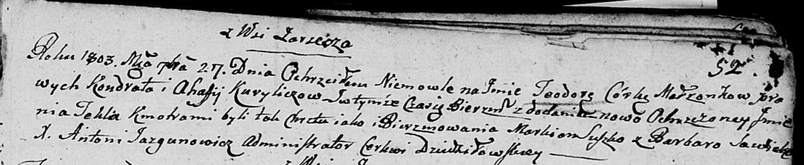

**Курилович Агафия (Kuryliczowa Ahafija)**

27 сентября 1803 г -- крещение дочери Теодоры Текли (НИАБ 136-13-894,
лист 52, №39/1803-р (ориг)).

**НИАБ 136-13-894:** Лист 52. **Метрическая запись №39/1803-р (ориг).**

{width="6.496527777777778in"
height="1.3430227471566054in"}

Дедиловичская Покровская церковь. 27 сентября 1803 года. Метрическая
запись о крещении.

Kuryliczowna Teodora Tekla -- дочь родителей с деревни Заречье.

Kurylicz Kondrat -- отец.

Kuryliczowa Ahafija -- мать.

Suszko Markian -- кум.

Sawicka Barbara -- кума.

Jazgunowicz Antoni -- ксёндз.
