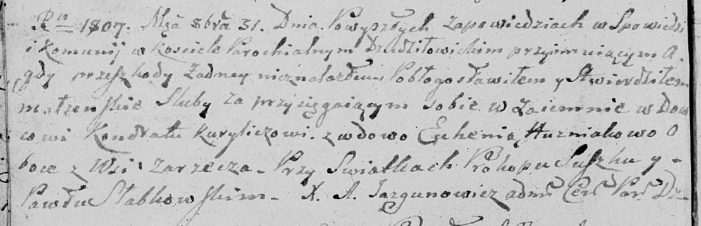
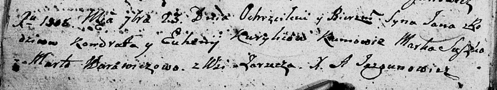

**Курилович Кондрат (Kurylić Kondrat)**

31 октября 1807 г -- венчание с вдовой Евгенией Гузняк с деревни Заречье
(НИАБ 136-13-920, лист 12об, №7/1807-б (ориг)).

23 сентября 1808 г -- крещение сына Яна (НИАБ 136-13-894, лист 65об,
№30/1808-р (ориг)).

**НИАБ 136-13-920:** Лист 12об. **Метрическая запись №7/1807-б (ориг).**

Дедиловичская Покровская церковь. 31 октября 1807 года. Метрическая
запись о венчании.

Kurylicz Kondrat -- жених, вдовец, с деревни Заречье.

Huzniakowa Euhenia -- невеста, вдова, с деревни Заречье.

Suszko Prokop -- свидетель.

Słabkowski Paweł -- свидетель.

Jazgunowicz Antoni -- ксёндз.

**НИАБ 136-13-894:** Лист 65об. **Метрическая запись №30/1808-р
(ориг).**

Дедиловичская Покровская церковь. 23 сентября 1808 года. Метрическая
запись о крещении.

Kurylić Jan -- сын родителей с деревни Заречье.

Kurylić Kondrat -- отец.

Kurylićowa Euhenija -- мать.

Suszko Marko -- кум.

Warawiczowa Marta -- кума.

Jazgunowicz Antoni -- ксёндз.
