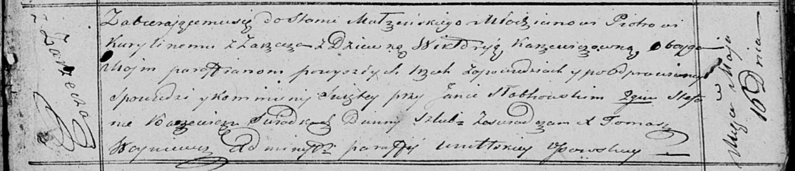

**Курилович Викторыя (Kurylinowa Wiktoryja)**

16 мая 1821 г -- венчание с солодым Петром Куриловичем с деревни Заречье
(НИАБ 136-13-920, лист 28, №5/1821-б (ориг)).

**НИАБ 136-13-920:** Лист 28. **Метрическая запись №5/1821-б (ориг).**

{width="6.496527777777778in"
height="1.4006856955380578in"}

Осовская Покровская церковь. 16 мая 1821 года. Запись о венчании.

Kurylin Piotr -- жених, молодой, парафии Осовской, с деревни Заречье.

Karżewiczowna Wiktoryja -- невеста, девка, парафии Осовской.

Słabkowski Jan -- свидетель.

Karżewicz Stefan -- свидетель.

Woyniewicz Tomasz -- ксёндз.
