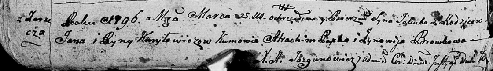
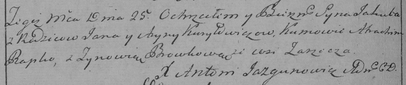

**Курилович Якуб Янов (Kuryłowicz Jakub)**

25 марта 1796 г -- крещение сына Якуба (НИАБ 136-13-894, лист 28об,
№37/1796-р (ориг)), (РГИА 823-2-18, лист 255об, №17/1796-р (коп)).

**НИАБ 136-13-894:** Лист 28-об. **Метрическая запись №37/1796-р
(ориг).**

Дедиловичская Покровская церковь. 25 марта 1796 года. Метрическая запись
о крещении.

Kuryłowicz Jakub -- сын родителей с деревни Заречье.

Kuryłowicz Jan -- отец.

Kuryłowiczowa Ryna -- мать.

Papko Atrachim - кум.

Browkowa Zynowija - кума.

Jazgunowicz Antoni -- ксёндз.

**РГИА 823-2-18:** Лист 255об. **Метрическая запись №17/1796-р (коп).**

Дедиловичская Покровская церковь. 25 марта 1796 года. Метрическая запись
о крещении.

Kuryłowicz Jakub -- сын родителей с деревни Заречье.

Kuryłowicz Jan -- отец.

Kuryłowiczowa Aryna -- мать.

Papko Atrachim -- кум.

Browkowa Zynowia -- кума.

Jazgunowicz Antoni -- ксёндз.
