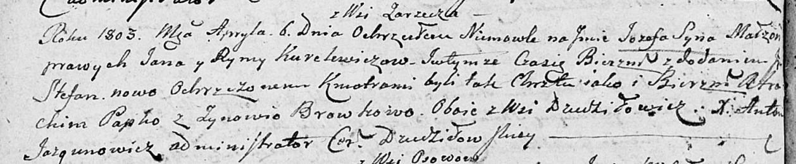

**Курилович Ян (Kuryłowicz, Kurelewicz Jan)**

25 марта 1796 г -- крещение сына Якуба (НИАБ 136-13-894, лист 28об,
№37/1796-р (ориг)), (РГИА 823-2-18, лист 255об, №17/1796-р (коп)).

6 апреля 1803 г -- крещение сына Иосифа Стефана (НИАБ 136-13-894, лист
50об, №20/1803-р (ориг)).

**НИАБ 136-13-894:** Лист 28-об. **Метрическая запись №37/1796-р
(ориг).**

{width="6.496527777777778in"
height="0.9454122922134733in"}

Дедиловичская Покровская церковь. 25 марта 1796 года. Метрическая запись
о крещении.

Kuryłowicz Jakub -- сын родителей с деревни Заречье.

Kuryłowicz Jan -- отец.

Kuryłowiczowa Ryna -- мать.

Papko Atrachim - кум.

Browkowa Zynowija - кума.

Jazgunowicz Antoni -- ксёндз.

**РГИА 823-2-18:** Лист 255об. **Метрическая запись №17/1796-р (коп).**

{width="6.496527777777778in"
height="1.363888888888889in"}

Дедиловичская Покровская церковь. 25 марта 1796 года. Метрическая запись
о крещении.

Kuryłowicz Jakub -- сын родителей с деревни Заречье.

Kuryłowicz Jan -- отец.

Kuryłowiczowa Aryna -- мать.

Papko Atrachim -- кум.

Browkowa Zynowia -- кума.

Jazgunowicz Antoni -- ксёндз.

**НИАБ 136-13-894:** Лист 50об. **Метрическая запись №20/1803-р
(ориг).**

{width="6.496527777777778in"
height="1.347716535433071in"}

Дедиловичская Покровская церковь. 6 апреля 1803 года. Метрическая запись
о крещении.

Kurelewicz Jozef Stefan -- сын родителей с деревни Заречье.

Kurelewicz Jan -- отец.

Kurelewiczowa Ryna -- мать.

Papko Atrachim -- кум, с деревни Дедиловичи.

Browkowa Zynowija -- кума, с деревни Дедиловичи.

Jazgunowicz Antoni -- ксёндз.
