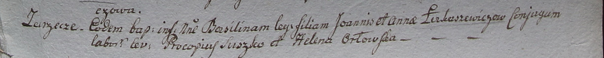

**Лукашевич Ян (Łukaszewicz Joann)**

5 марта 1799 г -- крещение дочери Базилины (НИАБ 1781-27-199, лист 125,
№19/1799-р).

**НИАБ 1781-27-199:** Лист 125. **Метрическая запись №19/1799-р.**

Дедиловичский костел Наисвятейшего Сердца Иисуса. 5 марта 1799 года.
Метрическая запись о крещении.

Łukaszewiczowna Basilina -- дочь крестьян с деревни Заречье.

Łukaszewicz Joann -- отец.

Łukaszewiczowa Anna -- мать.

Suszko Procopi -- крестный отец.

Orłowska Helena - крестная мать.

Linhart Hyacinthus -- ксёндз.
