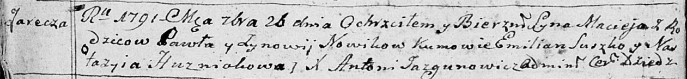
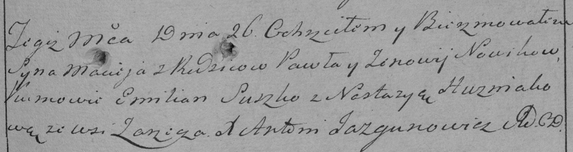

**Новик Павел (Nowik Paweł)**

26 сентября 1791 г -- крещение сына Мацея (НИАБ 136-13-894, лист 14об,
№62/1791-р (ориг)), (РГИА 823-2-18, лист 243, №32/1791-р (коп)).

**НИАБ 136-13-894:** Лист 14-об. **Метрическая запись №62/1791-р
(ориг).**

Дедиловичская Покровская церковь. 26 сентября 1791 года. Метрическая
запись о крещении.

Nowik Maciey -- сын родителей с деревни Заречье.

Nowik Paweł -- отец.

Nowikowa Zynowija -- мать.

Suszko Emilian - кум.

Huzniakowa Nastazyia - кума.

Jazgunowicz Antoni -- ксёндз.

**РГИА 823-2-18:** Лист 243. **Метрическая запись №32/1791-р (коп).**

Дедиловичская Покровская церковь. 26 \[сентября\] 1791 года. Метрическая
запись о крещении.

Nowik Maciey -- сын родителей с деревни Заречье.

Nowik Paweł -- отец.

Nowikowa Zenowija -- мать.

Suszko Emilian -- кум.

Huzniakowa Nastazya - кума.

Jazgunowicz Antoni -- ксёндз.
