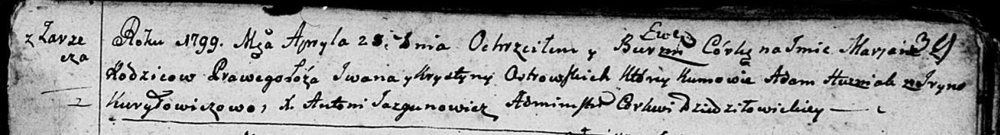
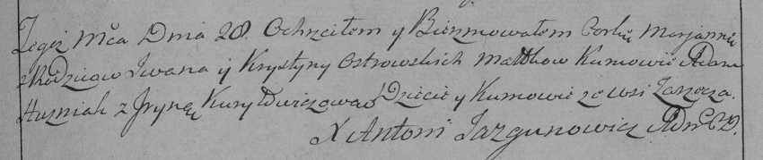
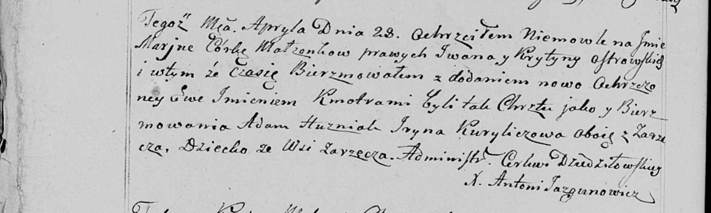

**Островская Марьяна Иванова (Ostrowska Marjana Ewa)**

28 апреля 1799 г -- крещение (НИАБ 136-13-894, лист 39, №19/1799-р
(ориг)), (РГИА 823-2-18, лист 269, №19/1799-р (коп), НИАБ 136-13-938,
лист 241об, №18/1799-р (коп)).

**НИАБ 136-13-894:** Лист 39. **Метрическая запись №19/1799-р (ориг).**

Дедиловичская Покровская церковь. 28 апреля 1799 года. Метрическая
запись о крещении.

Ostrowska Marjana Ewa-- дочь селян с деревни Заречье.

Ostrowski Jwan -- отец.

Ostrowska Krystyna -- мать, деревня Заречье.

Husziak Adam-- кум.

Kuryłowiczowa Jryna -- кума.

Jazgunowicz Antoni -- ксёндз.

**РГИА 823-2-18:** Лист 269. **Метрическая запись №19/1799-р (коп).**

Дедиловичская Покровская церковь. 28 апреля 1799 года. Метрическая
запись о крещении.

Ostrowska Marianna -- дочь родителей с деревни Заречье.

Ostrowski Jwan -- отец.

Ostrowska Krystyna -- мать.

Huzniak Adam -- кум, с деревни Заречье.

Kuryłowiczowa Jryna -- кума, с деревни Заречье.

Jazgunowicz Antoni -- ксёндз.

**НИАБ 136-13-938:** Лист 241об. **Метрическая запись №18/1799-р
(коп).**

(См. тж. НИАБ 136-13-894, лист 39, №19/1799-р (ориг); РГИА 823-2-18,
лист 269, №19/1799-р (коп))

Дедиловичская Покровская церковь. 28 апреля 1799 года. Метрическая
запись о крещении.

Ostrowska Marjana Ewa -- дочь родителей с деревни Заречье.

Ostrowski Jwan -- отец.

Ostrowska Krystyna -- мать.

Huzniak Adam -- кум, с деревни Заречье.

Kuryliczowa Jryna - кума, с деревни Заречье.

Jazgunowicz Antoni -- ксёндз.
