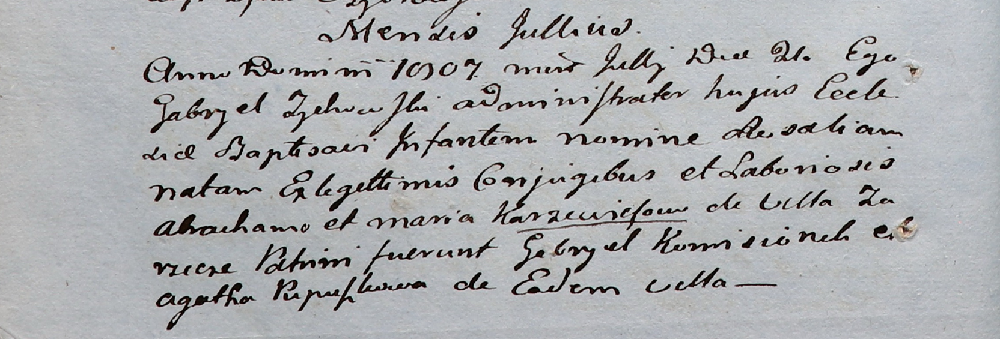

**Папушко Агата (Pupuszkowa Agatha)**

21 июля 1807 г -- крестная мать Розалии, дочери Аврама и Марии
Каржевичей с деревни Заречье (НИАБ 937-4-32, лист 15об, №13/1807-р).

**НИАБ 937-4-32:** Лист 15об. **Метрическая запись №13/1807-р.**

Дедиловичский костел Наисвятейшего Сердца Иисуса. 21 июля 1807 года.
Метрическая запись о крещении.

Karzewiczowna Rosalia -- дочь крестьян с деревни Заречье.

Karzewicz Abracham -- отец.

Karzewiczowa Maria -- мать.

Komisionek Gabriel -- крестный отец.

Pupuszkowa Agatha -- крестная мать, с деревни Заречье.

Zychowski Gabriel -- ксёндз.
