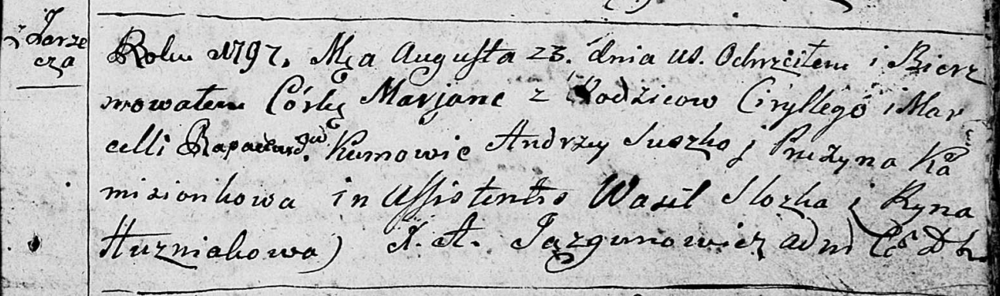

**Рапацевич Марьяна Цырыльева (Rapacewiczowna Marjana)**

23 августа 1795 г -- крещение (НИАБ 136-13-894, лист 34, №54/1797-р
(ориг)).

**НИАБ 136-13-894:** Лист 34. **Метрическая запись №54/1797-р (ориг).**

Дедиловичская Покровская церковь. 23 августа 1797 года. Метрическая
запись о крещении.

Rapacewiczowna Marjana -- дочь родителей с деревни Заречье.

Rapacewicz Cirylli -- отец.

Rapacewiczowa Marcella -- мать.

Suszko Andrzey - кум.

Kamizionkowa Pruzyna - кума.

Slozka Wasil - ассистент.

Huzniakowa Ryna - ассистентка.

Jazgunowicz Antoni -- ксёндз.
