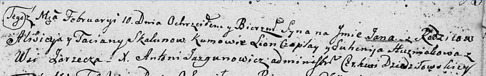

**Скакун Ян Алисеев (Skakun Jan)**

10 февраля 1807 г -- крещение (НИАБ 136-13-894, лист 62, №10/1807-р
(ориг)).

**НИАБ 136-13-894:** Лист 62. **Метрическая запись №10/1807-р (ориг).**

Дедиловичская Покровская церковь. 10 февраля 1807 года. Метрическая
запись о крещении.

Skakun Jan -- сын родителей с деревни Заречье.

Skakun Alisiey -- отец.

Skakunowa Taciana -- мать.

Czaplay Leon -- кум.

Huzniakowa Euhenija -- кума.

Jazgunowicz Antoni -- ксёндз.
