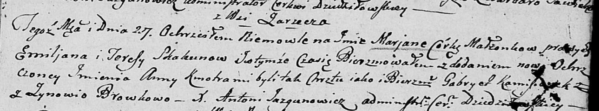

**Скакун Марьяна Емильянова (Skakunowna Marjana Anna)**

27 сентября 1803 г -- крещение (НИАБ 136-13-894, лист 52, №40/1803-р
(ориг)).

**НИАБ 136-13-894:** Лист 52. **Метрическая запись №40/1803-р (ориг).**

Дедиловичская Покровская церковь. 27 сентября 1803 года. Метрическая
запись о крещении.

Skakunowna Marjana Anna -- дочь родителей с деревни Заречье.

Skakun Emiljan -- отец.

Skakunowa Teresa -- мать.

Kaminski Gabriel -- кум.

Browkowa Zynowia -- кума.

Jazgunowicz Antoni -- ксёндз.
