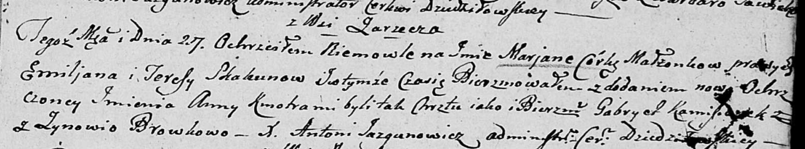

**Скакун Тереса (Skakunowa Teresa)**

27 сентября 1803 г -- крещение дочери Марьяны Анны (НИАБ 136-13-894,
лист 52, №40/1803-р (ориг)).

24 января 1805 г -- крещение дочери Татьяны Анны (НИАБ 136-13-894, лист
56об, №13/1805-р (ориг)).

**НИАБ 136-13-894:** Лист 52. **Метрическая запись №40/1803-р (ориг).**

Дедиловичская Покровская церковь. 27 сентября 1803 года. Метрическая
запись о крещении.

Skakunowna Marjana Anna -- дочь родителей с деревни Заречье.

Skakun Emiljan -- отец.

Skakunowa Teresa -- мать.

Kaminski Gabriel -- кум.

Browkowa Zynowia -- кума.

Jazgunowicz Antoni -- ксёндз.

**НИАБ 136-13-894:** Лист 56об. **Метрическая запись №13/1805-р
(ориг).**

Дедиловичская Покровская церковь. 24 января 1805 года. Метрическая
запись о крещении.

Skakunowna Taciana Anna -- дочь родителей с деревни Заречье.

Skakun Amiljan -- отец.

Skakunowa Teresa -- мать.

Kamizionek Gabriel -- кум.

Suszkowa Nasta -- кума, с деревни Дедиловичи.

Jazgunowicz Antoni -- ксёндз.
