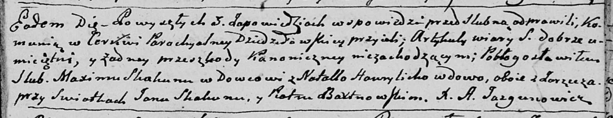

**Скакун Максим (Skakun Maxym)**

18 апреля 1795 г -- венчание с вдовой Натальей Гаврылихой с деревни
Заречье (НИАБ 136-13-920, лист 27, №4/1795-б (ориг)).

**НИАБ 136-13-920:** Лист 2. **Метрическая запись №4/1795-б (ориг).**

Дедиловичская Покровская церковь. 18 апреля 1795 года. Метрическая
запись о венчании.

Skakun Maxim -- жених, вдовец, деревня Заречье.

Hawrylicha Natalla -- невеста, вдова, деревня Заречье.

Skakun Jan -- свидетель.

Bartnowski Piotr -- свидетель.

Jazgunowicz Antoni -- ксёндз.
