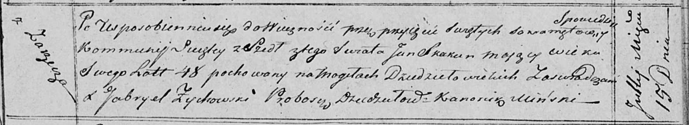

**Скакун Ян (Skakun Jan)**

15 июля 1818 г -- отпевание, умер в возрасте 48 лет (родился около 1770
г) (НИАБ 136-13-919, лист 32, №13/1818-у (ориг)).

**НИАБ 136-13-919:** Лист 32. **Метрическая запись №13/1818-у (ориг).**

{width="6.496527777777778in"
height="1.1868055555555554in"}

Осовская униатская церковь. 15 июля 1818 года. Метрическая запись об
отпевании.

Skakun Jan -- умерший, 48 лет, с деревни Заречье, похоронен на кладбище
деревни Дедиловичи.

Woyniewicz Tomasz -- ксёндз.
