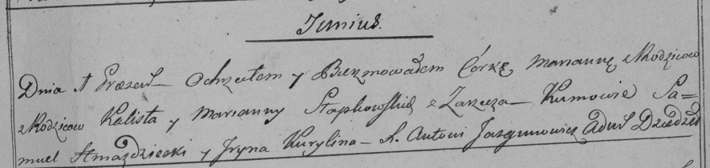

**Слабковская Марьяна Калистова (Słapkowska Marjana)**

1 июня 1798 г -- крещение (НИАБ 136-13-894, лист 36, №22/1798-р (ориг)),
(РГИА 823-2-18, лист 264, №22/1798-р (коп)).

**НИАБ 136-13-894:** Лист 36. **Метрическая запись №22/1798-р (ориг).**

{width="6.496527777777778in"
height="1.44292760279965in"}

Дедиловичская Покровская церковь. 1 июня 1798 года. Метрическая запись о
крещении.

Słapkowska Marjana -- дочь родителей с деревни Заречье.

Słapkowski Kalist -- отец.

Słapkowska Ullana -- мать.

Hniazdzicki Samuel - кум.

Kurylina Jryna - кума.

Jazgunowicz Antoni -- ксёндз.

**РГИА 823-2-18:** Лист 264. **Метрическая запись №22/1798-р (коп).**

{width="6.496527777777778in"
height="1.5416666666666667in"}

Дедиловичская Покровская церковь. 1 июня 1798 года. Метрическая запись о
крещении.

Słapkowska Marianna -- дочь родителей с деревни Заречье.

Słapkowski Kalist -- отец.

Słapkowska \[Ullana\] -- мать.

Hniazdzicki Samuel -- кум.

Kurylina Jryna -- кума.

Jazgunowicz Antoni -- ксёндз.
