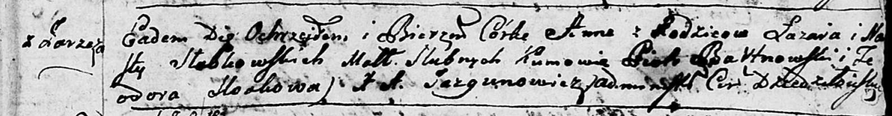
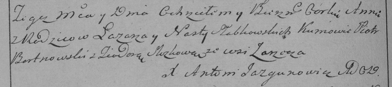

**Слабковская Анна Лазарева (Słabkowska Anna)**

23 декабря 1795 г -- крещение (НИАБ 136-13-894, лист 19, №28/1793-р
(ориг)), (РГИА 823-2-18, лист 254об, №48/1795-р (коп)).

**НИАБ 136-13-894:** Лист 27. **Метрическая запись №65/1795-р (ориг).**

Дедиловичская Покровская церковь. 23 декабря 1795 года. Метрическая
запись о крещении.

Słabkowska Anna -- дочь родителей с деревни Заречье.

Słabkowski Łazar -- отец.

Słabkowska Nasta -- мать.

Bartnowski Piotr - кум.

Sloskowa Teodora - кума.

Jazgunowicz Antoni -- ксёндз.

**РГИА 823-2-18:** Лист 254об. **Метрическая запись №48/1795-р (коп).**

Дедиловичская Покровская церковь. 23 декабря 1795 года. Метрическая
запись о крещении.

Słabkowska Anna -- дочь родителей с деревни Заречье.

Słabkowski Łazar -- отец.

Słabkowska Nasta -- мать.

Bortnowski Piotr -- кум.

Slozkowa Teodora -- кума.

Jazgunowicz Antoni -- ксёндз.
