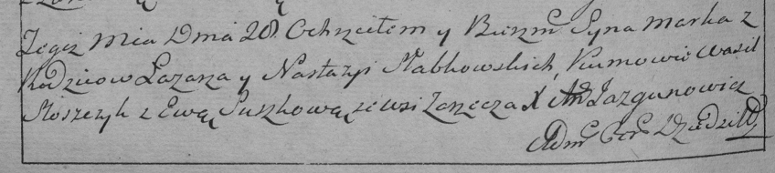

**Слабковская (Дударёнок) Настасья (Słabkowska, Słapkowska Nastazya,
Nasta z Dudaronkow)**

11 ноября 1787 г -- венчание с Лазарем Слабковским (НИАБ 136-13-894,
лист 66, №11/1787-б (ориг)).

21 апреля 1791 г -- крещение сына Марка (НИАБ 136-13-894, лист 13,
№18/1791-р (ориг)), (РГИА 823-2-18, лист 241об, №9/1791-р (коп)).

28 февраля 1793 г -- крещение сына Якуба (НИАБ 136-13-894, лист 19,
№28/1793-р (ориг)), (РГИА 823-2-18, лист 246об, №9/1793-р (коп)).

23 декабря 1795 г -- крещение дочери Анны (НИАБ 136-13-894, лист 19,
№28/1793-р (ориг)), (РГИА 823-2-18, лист 254об, №48/1795-р (коп)).

13 февраля 1799 г -- крещение сына Яна Балтромея (НИАБ 136-13-894, лист
38об, №10/1799-р (ориг)), (РГИА 823-2-18, лист 268об, №10/1799-р (коп),
НИАБ 136-13-938, лист 241, №10/1799-р (коп)).

25 декабря 1804 г -- крещение сына Стефана Якима (НИАБ 136-13-894, лист
56, №61/1804-р (ориг)).

28 февраля 1793 г -- крещение сына Якуба (НИАБ 136-13-894, лист 19,
№28/1793-р (ориг)).

23 декабря 1795 г -- крещение дочери Анны (НИАБ 136-13-894, лист 19,
№28/1793-р (ориг)).

13 февраля 1798 г -- крещение сына Яна Балтромея (НИАБ 136-13-894, лист
38об, №10/1799-р (ориг)).

25 декабря 1804 г -- крещение сына Стефана Якима (НИАБ 136-13-894, лист
56, №61/1804-р (ориг)).

4 апреля 1809 г -- крещение сына Иосифа Балтромея (НИАБ 136-13-894, лист
74, №16/1809-р (ориг)).

**НИАБ 136-13-894:** Лист 66. **Метрическая запись №11/1787-б (ориг).**

{width="6.496527777777778in"
height="0.9541294838145232in"}

Дедиловичская Покровская церковь. 11 ноября 1787 года. Метрическая
запись о венчании.

Słabkowski Łazar -- жених с деревни \[Заречье\].

Dudaronkowa Natalla \[Nastazya\] -- невеста.

Dudaronek Symon -- свидетель.

Słabkowski Michaś -- свидетель.

Jazgunowicz Antoni -- ксёндз.

**НИАБ 136-13-894:** Лист 13. **Метрическая запись №18/1791-р (ориг).**

{width="6.496527777777778in"
height="0.8153346456692914in"}

Дедиловичская Покровская церковь. 21 апреля 1791 года. Метрическая
запись о крещении.

Słapkowski Markо -- сын родителей с деревни Заречье.

Słapkowski Łazar -- отец.

Słapkowska Nastazya -- мать.

Slozczyk Wasil - кум.

Suszkowa Ewa - кума.

Jazgunowicz Antoni -- ксёндз.

**РГИА 823-2-18:** Лист 241об. **Метрическая запись №9/1791-р (коп).**

{width="6.496527777777778in"
height="1.4555555555555555in"}

Дедиловичская Покровская церковь. 20 апреля 1791 года. Метрическая
запись о крещении.

Słabkowski Marko -- сын родителей с деревни Заречье.

Słabkowski Łazar -- отец.

Słabkowska Nastazya -- мать.

Słosczyk Wasil -- кум.

Suszkowa Ewa - кума.

Jazgunowicz Antoni -- ксёндз.

**НИАБ 136-13-894:** Лист 19. **Метрическая запись №28/1793-р (ориг).**

{width="6.496527777777778in"
height="0.8823851706036745in"}

Дедиловичская Покровская церковь. 28 февраля 1793 года. Метрическая
запись о крещении.

Słabkowski Jakub -- сын родителей с деревни Заречье.

Słabkowski Łazarz -- отец.

Słabkowska Nastazyia -- мать.

Słozka Wasil - кум.

Szutowska Ewa - кума.

Jazgunowicz Antoni -- ксёндз.

**РГИА 823-2-18:** Лист 246об. **Метрическая запись №10/1793-р (коп).**

{width="6.496527777777778in"
height="1.5444444444444445in"}

Дедиловичская Покровская церковь. 28 февраля 1793 года. Метрическая
запись о крещении.

Słabkowski Jakub -- сын родителей с деревни Заречье.

Słabkowski Łazar -- отец.

Słabkowska Nastazya -- мать.

Słozka Wasil -- кум.

Szustowska Ewa -- кума.

Jazgunowicz Antoni -- ксёндз.

**НИАБ 136-13-894:** Лист 27. **Метрическая запись №65/1795-р (ориг).**

{width="6.496527777777778in"
height="0.8455074365704287in"}

Дедиловичская Покровская церковь. 23 декабря 1795 года. Метрическая
запись о крещении.

Słabkowska Anna -- дочь родителей с деревни Заречье.

Słabkowski Łazar -- отец.

Słabkowska Nasta -- мать.

Bartnowski Piotr - кум.

Sloskowa Teodora - кума.

Jazgunowicz Antoni -- ксёндз.

**РГИА 823-2-18:** Лист 254об. **Метрическая запись №48/1795-р (коп).**

{width="6.496527777777778in"
height="1.4409722222222223in"}

Дедиловичская Покровская церковь. 23 декабря 1795 года. Метрическая
запись о крещении.

Słabkowska Anna -- дочь родителей с деревни Заречье.

Słabkowski Łazar -- отец.

Słabkowska Nasta -- мать.

Bortnowski Piotr -- кум.

Slozkowa Teodora -- кума.

Jazgunowicz Antoni -- ксёндз.

**НИАБ 136-13-894:** Лист 38-об. **Метрическая запись №10/1799-р
(ориг).**

{width="6.496527777777778in"
height="1.0996292650918635in"}

Дедиловичская Покровская церковь. 13 февраля 1799 года. Метрическая
запись о крещении.

Słabkowski Jan Bautromey -- сын родителей с деревни Заречье.

Słabkowski Łazar -- отец.

Słabkowska Nastazyia -- мать.

Bartnowski Piotr \[Kiryka\]-- кум.

Sloskowa Chwiedora -- кума.

Jazgunowicz Antoni -- ксёндз.

**РГИА 823-2-18:** Лист 268об. **Метрическая запись №10/1799-р (коп).**

{width="6.496527777777778in"
height="1.2319444444444445in"}

Дедиловичская Покровская церковь. 13 февраля 1799 года. Метрическая
запись о крещении.

Słabkowski Jan -- сын родителей с деревни Заречье.

Słabkowski Łazarz -- отец.

Słabkowska Nastazya -- мать.

Bartnowski Piotr -- кум, с деревни Заречье.

Slozkowa Chwiedora -- кума, с деревни Заречье.

Jazgunowicz Antoni -- ксёндз.

**НИАБ 136-13-938:** Лист 241. **Метрическая запись №10/1799-р (коп).**

(См. тж. НИАБ 136-13-894, лист 38об, №10/1799-р (ориг); РГИА 823-2-18,
лист 268об, №10/1799-р (коп))

{width="6.496527777777778in"
height="2.245138888888889in"}

Дедиловичская Покровская церковь. 13 февраля 1799 года. Метрическая
запись о крещении.

Słabkowski Jan Bałtromiey -- сын родителей с деревни Заречье.

Słabkowski Łazarz -- отец.

Słabkowska Nastazya -- мать.

Bartnowski Piotr -- кум, с деревни Дедиловичи.

Slozkowa Chwiedora - кума, с деревни Дедиловичи.

Jazgunowicz Antoni -- ксёндз.

**НИАБ 136-13-894:** Лист 56. **Метрическая запись №61/1804-р (ориг).**

{width="6.496527777777778in"
height="1.1123687664041995in"}

Дедиловичская Покровская церковь. 25 декабря 1804 года. Метрическая
запись о крещении.

Słapkowski Stefan Jakim -- сын родителей с деревни Заречье.

Słapkowski Łazarz -- отец.

Słapkowska Nastazya -- мать.

Bartnowski Piotr -- кум.

Słapkowska Krystyna -- кума.

Jazgunowicz Antoni -- ксёндз.

**НИАБ 136-13-894:** Лист 74. **Метрическая запись №16/1809-р (ориг).**

{width="6.496527777777778in"
height="1.3959919072615923in"}

Дедиловичская Покровская церковь. 4 апреля 1809 года. Метрическая запись
о крещении .

Słabkowski Jozef Baltromey -- сын родителей с деревни \[Заречье\].

Słabkowski Łazar -- отец.

Słabkowska Nasta -- мать.

Suszko Markian -- кум.

Słoskowa Krystyna -- кума.

Jazgunowicz Antoni -- ксёндз.
