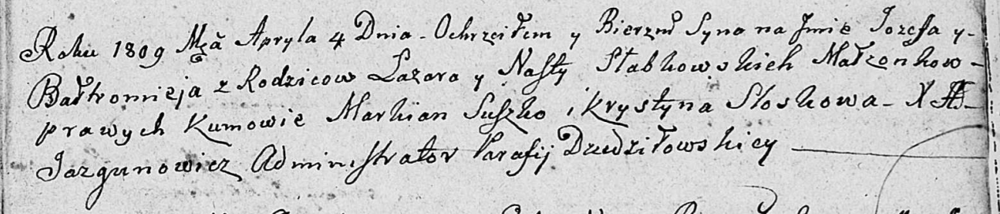

**Слабковский Иосиф Лазарев (Słabkowski Jozef Bałtromiey)**

4 апреля 1809 г -- крещение (НИАБ 136-13-894, лист 74, №16/1809-р
(ориг)).

**НИАБ 136-13-894:** Лист 74. **Метрическая запись №16/1809-р (ориг).**

Дедиловичская Покровская церковь. 4 апреля 1809 года. Метрическая запись
о крещении .

Słabkowski Jozef Baltromey -- сын родителей с деревни \[Заречье\].

Słabkowski Łazar -- отец.

Słabkowska Nasta -- мать.

Suszko Markian -- кум.

Słoskowa Krystyna -- кума.

Jazgunowicz Antoni -- ксёндз.
