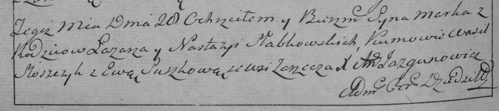

**Слабковский Марко Лазарев (Słapkowski Marko)**

21 апреля 1791 г -- крещение (НИАБ 136-13-894, лист 13, №18/1791-р
(ориг)), (РГИА 823-2-18, лист 241об, №9/1791-р (коп)).

28 февраля 1793 г -- крещение сына Якуба (НИАБ 136-13-894, лист 19,
№28/1793-р (ориг)).

23 декабря 1795 г -- крещение дочери Анны (НИАБ 136-13-894, лист 19,
№28/1793-р (ориг)).

13 февраля 1798 г -- крещение сына Яна Балтромея (НИАБ 136-13-894, лист
38об, №10/1799-р (ориг)).

25 декабря 1804 г -- крещение сына Стефана Якима (НИАБ 136-13-894, лист
56, №61/1804-р (ориг)).

**НИАБ 136-13-894:** Лист 13. **Метрическая запись №18/1791-р (ориг).**

Дедиловичская Покровская церковь. 21 апреля 1791 года. Метрическая
запись о крещении.

Słapkowski Markо -- сын родителей с деревни Заречье.

Słapkowski Łazar -- отец.

Słapkowska Nastazya -- мать.

Slozczyk Wasil - кум.

Suszkowa Ewa - кума.

Jazgunowicz Antoni -- ксёндз.

**РГИА 823-2-18:** Лист 241об. **Метрическая запись №9/1791-р (коп).**

Дедиловичская Покровская церковь. 20 апреля 1791 года. Метрическая
запись о крещении.

Słabkowski Marko -- сын родителей с деревни Заречье.

Słabkowski Łazar -- отец.

Słabkowska Nastazya -- мать.

Słosczyk Wasil -- кум.

Suszkowa Ewa - кума.

Jazgunowicz Antoni -- ксёндз.
