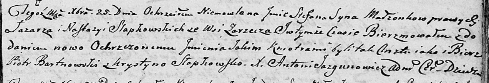

**Слабковский Стефан Лазарев (Słapkowski Stefan Jakim)**

25 декабря 1804 г -- крещение (НИАБ 136-13-894, лист 56, №61/1804-р
(ориг)).

**НИАБ 136-13-894:** Лист 56. **Метрическая запись №61/1804-р (ориг).**

Дедиловичская Покровская церковь. 25 декабря 1804 года. Метрическая
запись о крещении.

Słapkowski Stefan Jakim -- сын родителей с деревни Заречье.

Słapkowski Łazarz -- отец.

Słapkowska Nastazya -- мать.

Bartnowski Piotr -- кум.

Słapkowska Krystyna -- кума.

Jazgunowicz Antoni -- ксёндз.
