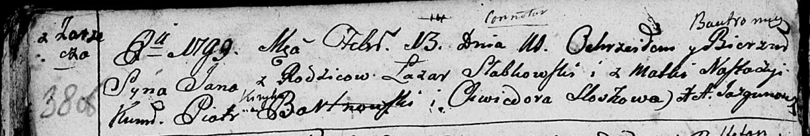

**Слабковский Ян Лазарев (Słabkowski Jan Bautromiey)**

13 февраля 1799 г -- крещение (НИАБ 136-13-894, лист 38об, №10/1799-р
(ориг)), (РГИА 823-2-18, лист 268об, №10/1799-р (коп), НИАБ 136-13-938,
лист 241, №10/1799-р (коп)).

**НИАБ 136-13-894:** Лист 38-об. **Метрическая запись №10/1799-р
(ориг).**

Дедиловичская Покровская церковь. 13 февраля 1799 года. Метрическая
запись о крещении.

Słabkowski Jan Bautromey -- сын родителей с деревни Заречье.

Słabkowski Łazar -- отец.

Słabkowska Nastazyia -- мать.

Bartnowski Piotr \[Kiryka\]-- кум.

Sloskowa Chwiedora -- кума.

Jazgunowicz Antoni -- ксёндз.

**РГИА 823-2-18:** Лист 268об. **Метрическая запись №10/1799-р (коп).**

Дедиловичская Покровская церковь. 13 февраля 1799 года. Метрическая
запись о крещении.

Słabkowski Jan -- сын родителей с деревни Заречье.

Słabkowski Łazarz -- отец.

Słabkowska Nastazya -- мать.

Bartnowski Piotr -- кум, с деревни Заречье.

Slozkowa Chwiedora -- кума, с деревни Заречье.

Jazgunowicz Antoni -- ксёндз.

**НИАБ 136-13-938:** Лист 241. **Метрическая запись №10/1799-р (коп).**

(См. тж. НИАБ 136-13-894, лист 38об, №10/1799-р (ориг); РГИА 823-2-18,
лист 268об, №10/1799-р (коп))

Дедиловичская Покровская церковь. 13 февраля 1799 года. Метрическая
запись о крещении.

Słabkowski Jan Bałtromiey -- сын родителей с деревни Заречье.

Słabkowski Łazarz -- отец.

Słabkowska Nastazya -- мать.

Bartnowski Piotr -- кум, с деревни Дедиловичи.

Slozkowa Chwiedora - кума, с деревни Дедиловичи.

Jazgunowicz Antoni -- ксёндз.
