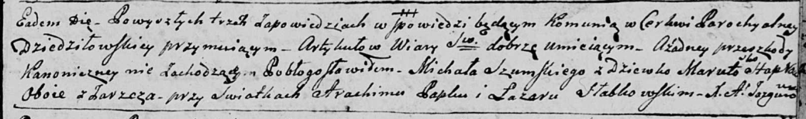

**Шумская (Слабковская) Марута (Szumska Maruta z Słabkowskich)**

10 февраля 1796 г -- венчание с Михалом Шумским с деревни Заречье (НИАБ
136-13-920, лист 3, №5/1796-б (ориг)).

**НИАБ 136-13-920:** Лист 3. **Метрическая запись №5/1796-б (ориг).**

Дедиловичская Покровская церковь. 10 февраля 1796 года. Метрическая
запись о венчании.

Szumski Michał -- жених, деревня Заречье.

Słapkowska Maruta -- невеста, девка, деревня Заречье.

Papko Atrachim -- свидетель.

Słabkowski Łazar -- свидетель.

Jazgunowicz Antoni -- ксёндз.
