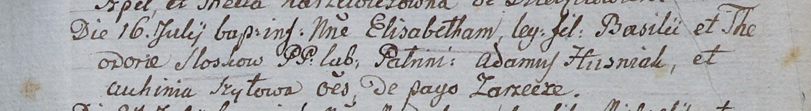

**Слёзко Макрына (Słozkowna Macrina)**

26 ноября 1802 г -- крещение дочери (НИАБ 937-4-32, лист 8, №41/1802-р).

**НИАБ 937-4-32:** Лист 8. **Метрическая запись №41/1802-р.**

{width="6.496527777777778in"
height="0.8638888888888889in"}

Дедиловичский костел Наисвятейшего Сердца Иисуса. 26 ноября 1802 года.
Метрическая запись о крещении.

Szłoskowna Maсrina -- дочь крестьян с деревни Заречье.

Szłoska Basili -- отец.

Szłoskowa Chwiedora -- мать.

Huzniak Adam -- крестный отец.

Szyłowa Auchinia -- крестная мать, с деревни Шилы.

Linhart Hyacinthus -- ксёндз.
