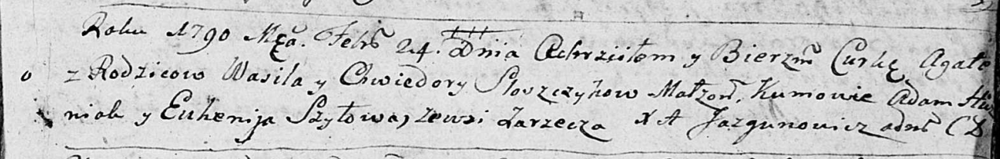

**Слёшчык Хведора (Sloszczykowa Chwiedora)**

24 февраля 1790 г -- крещение дочери Агаты (НИАБ 136-13-894, лист 9,
№14/1790-р (ориг)).

**НИАБ 136-13-894:** Лист 9. **Метрическая запись №14/1790-р (ориг).**

{width="6.496527777777778in"
height="1.0372725284339457in"}

Дедиловичская Покровская церковь. 24 февраля 1790 года. Метрическая
запись о крещении.

Sloszczykowna Agata -- дочь родителей с деревни Заречье.

Sloszczyk Wasil -- отец.

Sloszczykowa Chwiedora -- мать.

Huzniak Adam - кум.

Szyłowa Euhenija - кума.

Jazgunowicz Antoni -- ксёндз.
