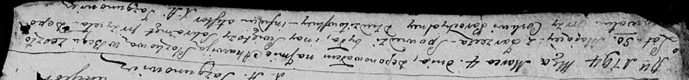

**Слёзко Агата (Słozkowa Agata)**

4 марта 1794 г -- отпевание, с деревни Заречье, умерла в возрасте 50 лет
(НИАБ 136-13-919, лист 1об, №11/1794-б (ориг)).

**НИАБ 136-13-894:** Лист 1об. **Метрическая запись №11/1794-у (ориг).**

{width="6.496527777777778in"
height="0.7652777777777777in"}

Дедиловичская Покровская церковь. 4 марта 1794 года. Метрическая запись
об отпевании.

Słozkowa Ahawija -- умершая, 50 лет, с деревни Заречье, похоронена при
церкви Дедиловичской.

Jazgunowicz Antoni -- ксёндз.
