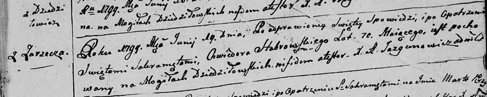
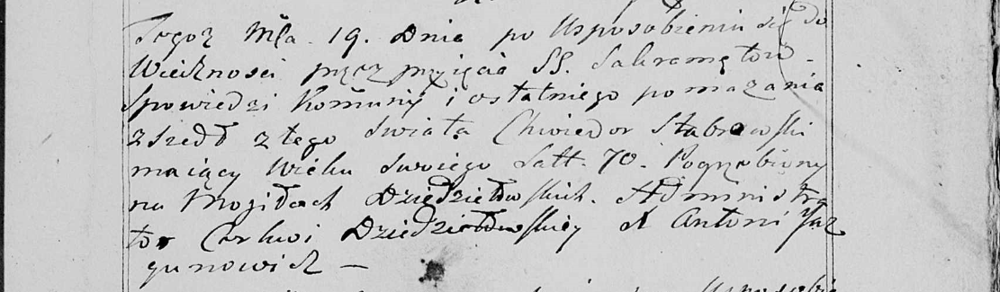

**Стабровский Хведор (Stabrowski Chwiedor)**

19 июня 1799 г -- отпевание, умер в возрасте 70 лет (родился около 1729
г) (НИАБ 136-13-919, лист 9, №10/1799-у (ориг), НИАБ 136-13-938, лист
251, №10/1799-у (коп)).

**НИАБ 136-13-919:** Лист 9. **Метрическая запись №10/1799-у (ориг).**

Дедиловичская Покровская церковь. 19 июня 1799 года. Метрическая запись
об отпевании.

Stabrowski Chwiedor -- умерший, 70 лет, с деревни Заречье, похоронен на
кладбище деревни Дедиловичи.

Jazgunowicz Antoni -- ксёндз.

**НИАБ 136-13-938:** Лист 251. **Метрическая запись №10/1799-у (коп).**

(См. тж. НИАБ 136-13-919, Лист 9. Метрическая запись №10/1799-у (ориг))

Дедиловичская Покровская церковь. 19 июня 1799 года. Метрическая запись
об отпевании.

Stabrowski Chwiedor -- умерший, 70 лет, с деревни \[Заречье\], похоронен
на кладбище деревни Дедиловичи.

Jazgunowicz Antoni -- ксёндз.
