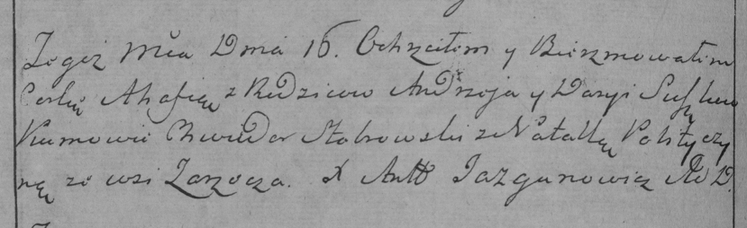

**Сушко Агафия Андреева (Suszkowna Ahafia)**

15 февраля 1785 г -- крещение (РГИА 823-2-18, лист 228об, №5/1785-р
(ориг)).

**РГИА 823-2-18:** Лист 228об. **Метрическая запись №5/1785-р (коп).**

{width="6.496527777777778in"
height="1.9902777777777778in"}

Дедиловичская Покровская церковь. 15 февраля 1785 года. Метрическая
запись о крещении.

Suszkowna Ahafia -- дочь родителей с деревни Заречье.

Suszko Andrzey -- отец.

Suszkowa Darya -- мать.

Stohowski Chwiedor -- кум.

Polityczyna Natalla - кума.

Jazgunowicz Antoni -- ксёндз.
