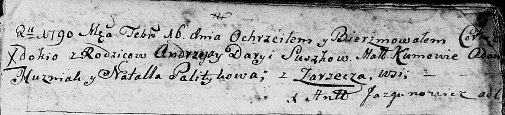
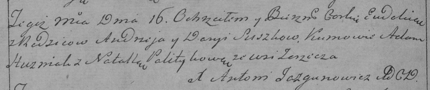

**Сушко Евдокия Андреева (Suszkowna Ewdokia)**

16 февраля 1790 г -- крещение (НИАБ 136-13-894, лист 9, №12/1790-р
(ориг)), (РГИА 823-2-18, лист 239об, №7/1790-р (коп)).

**НИАБ 136-13-894:** Лист 9. **Метрическая запись №12/1790-р (ориг).**

Дедиловичская Покровская церковь. 16 февраля 1790 года. Метрическая
запись о крещении.

Suszkowna Ewdokia -- дочь родителей с деревни Заречье.

Suszko Andrzej -- отец.

Suszkowa Darya -- мать.

Huzniak Adam - кум.

Palitykowa Natalla - кума.

Jazgunowicz Antoni -- ксёндз.

**РГИА 823-2-18:** Лист 239об. **Метрическая запись №7/1790-р (коп).**

Дедиловичская Покровская церковь. 16 февраля 1790 года. Метрическая
запись о крещении.

Suszkowna Eudokia -- дочь родителей с деревни Заречье.

Suszko Andrzey -- отец.

Suszko Darya -- мать.

Huzniak Adam -- кум.

Politykowa Natalla - кума.

Jazgunowicz Antoni -- ксёндз.
