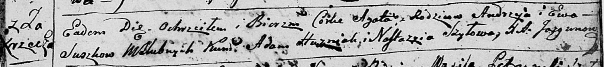

**Сушко Агата Андреева (Suszkowna Agata)**

21 апреля 1796 г -- крещение (НИАБ 136-13-894, лист 29, №48/1796-р
(ориг)).

**НИАБ 136-13-894:** Лист 29. **Метрическая запись №48/1796-р (ориг).**

{width="6.496527777777778in"
height="0.7241458880139983in"}

Дедиловичская Покровская церковь. 21 апреля 1796 года. Метрическая
запись о крещении.

Suszkowna Agata -- дочь родителей с деревни Заречье.

Suszko Andrzey -- отец.

Suszkowa Ewa -- мать.

Huzniak Adam - кум.

Szyłowa Nastazyia - кума.

Jazgunowicz Antoni -- ксёндз.
