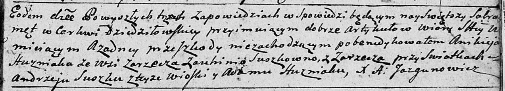
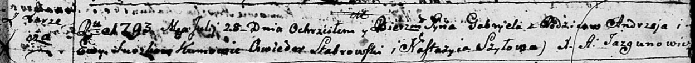
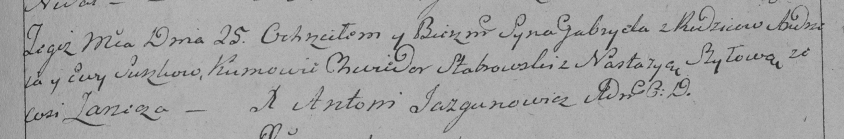
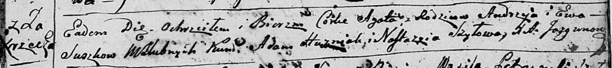
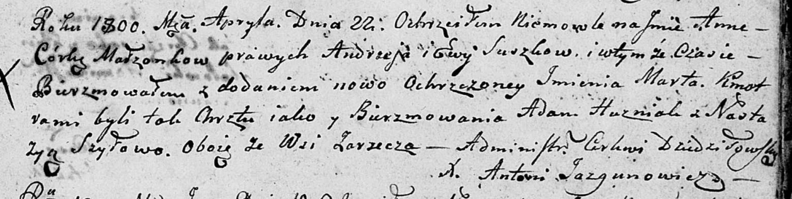
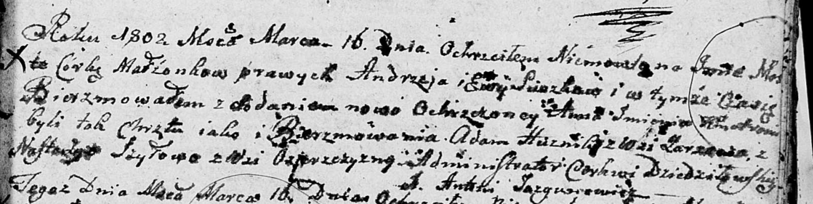
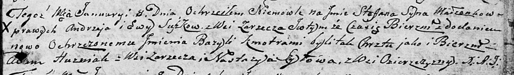
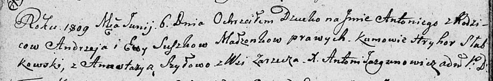

**Сушко Андрей (Suszko Andrzej)**

7 октября 1792 г -- вероятно, свидетель при венчании Аникея Гузняка с
деревни Заречье и Евгении Сушко с деревни Заречье (НИАБ 136-13-894, лист
71, №15/1792-б (ориг)).

25 июля 1793 г -- крещение сына Габриэля (НИАБ 136-13-894, лист 20,
№57/1793-р (ориг)), (РГИА 823-2-18, лист 248, №31/1793-р (коп)).

21 апреля 1796 г -- крещение дочери Агаты (НИАБ 136-13-894, лист 29,
№48/1796-р (ориг)).

22 апреля 1800 г -- крещение дочери Анны Марты (НИАБ 136-13-894, лист
41, №14/1800-р (ориг), НИАБ 136-13-949, лист 102, №14/1800-р (коп)).

16 марта 1802 г -- крещение дочери Марты Анны (НИАБ 136-13-894, лист 46,
№10/1802-р (ориг)).

8 января 1805 г -- крещение сына Стефана Базыля (НИАБ 136-13-894, лист
56, №5/1805-р (ориг)).

6 июня 1809 г -- крещение сына Антона (НИАБ 136-13-894, лист 74об,
№27/1809-р (ориг)).

**НИАБ 136-13-894:** Лист 71. **Метрическая запись №15/1792-б (ориг).**

Дедиловичская Покровская церковь. 7 октября 1792 года. Метрическая
запись о венчании.

Huzniak Anikiey -- жених, с деревни Заречье.

Suszkowna Auhima \[Euhenia\] -- невеста, с деревни Заречье.

Suszko Andrzey -- свидетель, с деревни Заречье.

Huzniak Adam -- свидетель.

Jazgunowicz Antoni -- ксёндз.

**НИАБ 136-13-894:** Лист 20. **Метрическая запись №57/1793-р (ориг).**

Дедиловичская Покровская церковь. 25 июля 1793 года. Метрическая запись
о крещении.

Suszko Gabryel -- сын родителей с деревни Заречье.

Suszko Andrzey -- отец.

Suszkowa Ewa -- мать.

Słabkowski Chwiedor - кум.

Szyłowa Nastazyia - кума.

Jazgunowicz Antoni -- ксёндз.

**РГИА 823-2-18:** Лист 248. **Метрическая запись №31/1793-р (коп).**

Дедиловичская Покровская церковь. 25 июля 1793 года. Метрическая запись
о крещении.

Suszko Gabriel -- сын родителей с деревни Заречье.

Suszko Andrzey -- отец.

Suszkowa Ewa -- мать.

Stabrowski Chwiedor -- кум.

Szyłowa Nastazya -- кума.

Jazgunowicz Antoni -- ксёндз.

**НИАБ 136-13-894:** Лист 29. **Метрическая запись №48/1796-р (ориг).**

Дедиловичская Покровская церковь. 21 апреля 1796 года. Метрическая
запись о крещении.

Suszkowna Agata -- дочь родителей с деревни Заречье.

Suszko Andrzey -- отец.

Suszkowa Ewa -- мать.

Huzniak Adam - кум.

Szyłowa Nastazyia - кума.

Jazgunowicz Antoni -- ксёндз.

**НИАБ 136-13-894:** Лист 41. **Метрическая запись №14/1800-р (ориг).**

Дедиловичская Покровская церковь. 22 апреля 1800 года. Метрическая
запись о крещении.

Suszkowna Anna Marta -- дочь родителей \[с деревни Заречье\].

Suszko Andrzey -- отец.

Suszkowa Ewa -- мать.

Huzniak Adam -- кум, с деревни Заречье.

Szyłowa Nastazyja -- кума, с деревни Заречье.

Jazgunowicz Antoni -- ксёндз.

**НИАБ 136-13-949:** Лист 102. **Метрическая запись №14/1800-р (коп).**

(См. тж.: НИАБ 136-13-894, лист 41, №14/1800-р (ориг))

Дедиловичская Покровская церковь. 22 апреля 1800 года. Метрическая
запись о крещении.

Suszkowna Anna Marta -- дочь родителей с деревни Дедиловичи \[Заречье\].

Suszko Andrzey -- отец.

Suszkowa Ewa -- мать.

Huznak Adam -- кум, с деревни \[Заречье\].

Szyłowa Nastazya - кума, с деревни Заречье.

Jazgunowicz Antoni -- ксёндз.

**НИАБ 136-13-894:** Лист 46. **Метрическая запись №10/1802-р (ориг).**

Дедиловичская Покровская церковь. 16 марта 1802 года. Метрическая запись
о крещении.

Suszkowna Marta Anna -- дочь родителей \[с деревни Заречье\].

Suszko Andrzey -- отец.

Suszkowa Ewa -- мать.

Huszniak Adam -- кум, с деревни Заречье.

Szyłowa Nastazya -- кума, с деревни Озерщизна.

Jazgunowicz Antoni -- ксёндз.

**НИАБ 136-13-894:** Лист 56. **Метрическая запись №5/1805-р (ориг).**

Дедиловичская Покровская церковь. 8 января 1805 года. Метрическая запись
о крещении.

Suszko Stefan Bazyli -- сын родителей с деревни Заречье.

Suszko Andrzey -- отец.

Suszkowa Ewa -- мать.

Huzniak Adam -- кум, с деревни Заречье.

Szyłowa Nastazya -- кума, с деревни Озерщизна.

Jazgunowicz Antoni -- ксёндз.

**НИАБ 136-13-894:** Лист 74об. **Метрическая запись №27/1809-р
(ориг).**

Дедиловичская Покровская церковь. 6 июня 1809 года. Метрическая запись о
крещении.

Suszko Antoni -- сын родителей с деревни Заречье.

Suszko Andrzey -- отец.

Suszkowa Ewa -- мать.

Słabkowski Hryhor -- кум.

Szyłowa Anastazya -- кума.

Jazgunowicz Antoni -- ксёндз.
