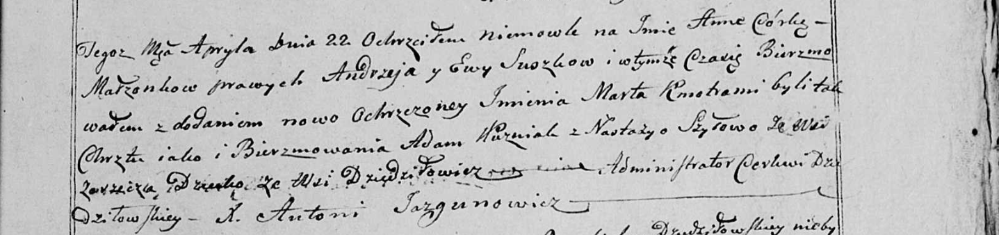

**Сушко Анна (Suszkowna Anna)**

22 апреля 1800 г -- крещение (НИАБ 136-13-894, лист 41, №14/1800-р
(ориг), НИАБ 136-13-949, лист 102, №14/1800-р (коп)).

**НИАБ 136-13-894:** Лист 41. **Метрическая запись №14/1800-р (ориг).**

{width="6.496527777777778in"
height="1.6380446194225722in"}

Дедиловичская Покровская церковь. 22 апреля 1800 года. Метрическая
запись о крещении.

Suszkowna Anna Marta -- дочь родителей \[с деревни Заречье\].

Suszko Andrzey -- отец.

Suszkowa Ewa -- мать.

Huzniak Adam -- кум, с деревни Заречье.

Szyłowa Nastazyja -- кума, с деревни Заречье.

Jazgunowicz Antoni -- ксёндз.

**НИАБ 136-13-949:** Лист 102. **Метрическая запись №14/1800-р (коп).**

(См. тж.: НИАБ 136-13-894, лист 41, №14/1800-р (ориг))

{width="6.496527777777778in"
height="1.5277777777777777in"}

Дедиловичская Покровская церковь. 22 апреля 1800 года. Метрическая
запись о крещении.

Suszkowna Anna Marta -- дочь родителей с деревни Дедиловичи \[Заречье\].

Suszko Andrzey -- отец.

Suszkowa Ewa -- мать.

Huznak Adam -- кум, с деревни \[Заречье\].

Szyłowa Nastazya - кума, с деревни Заречье.

Jazgunowicz Antoni -- ксёндз.
