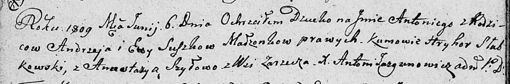

**Сушко Антон Андреев (Suszko Antoni)**

6 июня 1809 г -- крещение (НИАБ 136-13-894, лист 74об, №27/1809-р
(ориг)).

**НИАБ 136-13-894:** Лист 74об. **Метрическая запись №27/1809-р
(ориг).**

{width="6.496527777777778in"
height="1.0748206474190727in"}

Дедиловичская Покровская церковь. 6 июня 1809 года. Метрическая запись о
крещении.

Suszko Antoni -- сын родителей с деревни Заречье.

Suszko Andrzey -- отец.

Suszkowa Ewa -- мать.

Słabkowski Hryhor -- кум.

Szyłowa Anastazya -- кума.

Jazgunowicz Antoni -- ксёндз.
