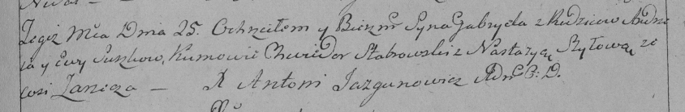

**Сушко Габриэль Андреев (Suszko Gabriel)**

25 июля 1793 г -- крещение (НИАБ 136-13-894, лист 20, №57/1793-р
(ориг)), (РГИА 823-2-18, лист 248, №31/1793-р (коп)).

**НИАБ 136-13-894:** Лист 20. **Метрическая запись №57/1793-р (ориг).**

{width="6.496527777777778in"
height="0.5933978565179353in"}

Дедиловичская Покровская церковь. 25 июля 1793 года. Метрическая запись
о крещении.

Suszko Gabryel -- сын родителей с деревни Заречье.

Suszko Andrzey -- отец.

Suszkowa Ewa -- мать.

Słabkowski Chwiedor - кум.

Szyłowa Nastazyia - кума.

Jazgunowicz Antoni -- ксёндз.

**РГИА 823-2-18:** Лист 248. **Метрическая запись №31/1793-р (коп).**

{width="6.496527777777778in"
height="1.070138888888889in"}

Дедиловичская Покровская церковь. 25 июля 1793 года. Метрическая запись
о крещении.

Suszko Gabriel -- сын родителей с деревни Заречье.

Suszko Andrzey -- отец.

Suszkowa Ewa -- мать.

Stabrowski Chwiedor -- кум.

Szyłowa Nastazya -- кума.

Jazgunowicz Antoni -- ксёндз.
