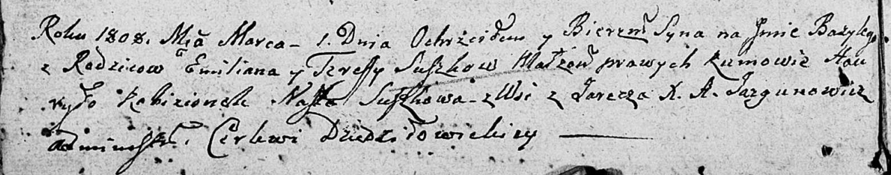

**Сушко Тереса (Suszkowa Teresa)**

1 марта 1808 г -- крещение сына Базыля (НИАБ 136-13-894, лист 65,
№12/1808-р (ориг)).

**НИАБ 136-13-894:** Лист 65. **Метрическая запись №12/1808-р (ориг).**

Дедиловичская Покровская церковь. 1 марта 1808 года. Метрическая запись
о крещении.

Suszko Bazyli -- сын родителей с деревни Заречье.

Suszko Emilian -- отец.

Suszkowa Teresa -- мать.

Kabizionek Hauryło -- кум.

Suszkowa Nasta -- кума.

Jazgunowicz Antoni -- ксёндз.
