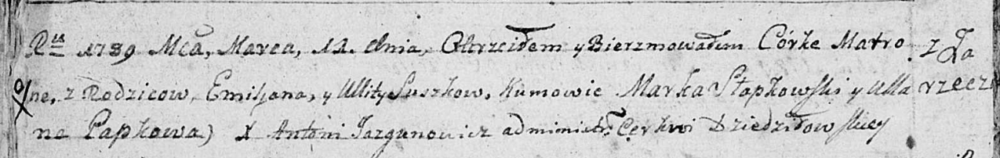

**Сушко Адам Емельянов (Suszko Adam)**

19 апреля 1792 г -- крещение (НИАБ 136-13-894, лист 15об, №22/1792-р
(ориг)), (РГИА 823-2-18, лист 244, №9/1792-р (коп)).

**НИАБ 136-13-894:** Лист 15об. **Метрическая запись №22/1792-р
(ориг).**

{width="6.496527777777778in"
height="1.212273622047244in"}

Дедиловичская Покровская церковь. 19 апреля 1792 года. Метрическая
запись о крещении.

Suszko Adam -- сын родителей с деревни Заречье.

Suszko Emiljan -- отец.

Suszkowa Ullita -- мать.

Szuszko Klemiata - кум.

Szłozkowa Chwiedora - кума.

Słapkowski Marko -- ассистент.

Papkowa Ullana -- ассистентка.

Jazgunowicz Antoni -- ксёндз.

**РГИА 823-2-18:** Лист 244. **Метрическая запись №9/1792-р (коп).**

{width="6.496527777777778in"
height="1.5041666666666667in"}

Дедиловичская Покровская церковь. 19 апреля 1792 года. Метрическая
запись о крещении.

Suszko Adam -- сын родителей с деревни Заречье.

Suszko Emilian -- отец.

Suszkowa Ulita -- мать.

Suszko Klemens -- кум.

\[Szłozkowa\] Chwiedora - кума.

Jazgunowicz Antoni -- ксёндз.
