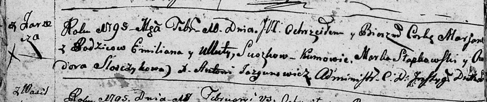
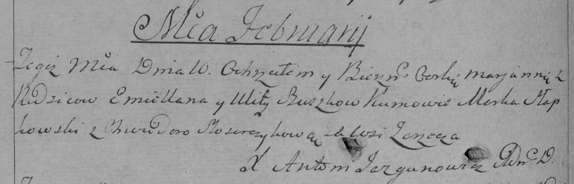

**Сушко Марьяна Емельянова (Suszkowna Marjana)**

10 февраля 1795 г -- крещение (НИАБ 136-13-894, лист 23об, №2/1795-р
(ориг)), (РГИА 823-2-18, лист 251об, №2/1795-р (коп)).

**НИАБ 136-13-894:** Лист 23об. **Метрическая запись №2/1795-р (ориг).**

Дедиловичская Покровская церковь. 10 февраля 1795 года. Метрическая
запись о крещении.

Suszkowna Marjana -- дочь родителей с деревни Заречье.

Suszko Emilian -- отец.

Suszkowa Ullita -- мать.

Słapkowski Marka - кум.

Słosczykowa Chwiedora - кума.

Jazgunowicz Antoni -- ксёндз.

**РГИА 823-2-18:** Лист 251об. **Метрическая запись №2/1795-р (коп).**

Дедиловичская Покровская церковь. 10 февраля 1795 года. Метрическая
запись о крещении.

Szuszkowna Marjanna -- дочь родителей с деревни Заречье.

Szuszko Emiellan -- отец.

Szuszkowa Ulita -- мать.

Słapkowski Marko -- кум.

Sloszczykowa Chwiedora -- кума.

Jazgunowicz Antoni -- ксёндз.
