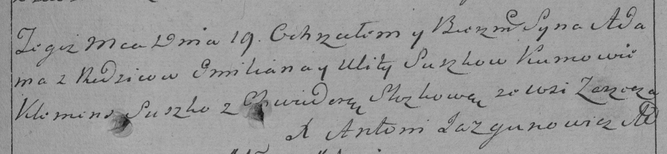

**Сушко Улита (Suszkowa Ullita)**

11 марта 1789 г -- крещение дочери Матроны (НИАБ 136-13-894, лист 6об,
№16/1789-р (ориг)).

19 апреля 1792 г -- крещение сына Адама (НИАБ 136-13-894, лист 15об,
№22/1792-р (ориг)), (РГИА 823-2-18, лист 244, №9/1792-р (коп)).

10 февраля 1795 г -- крещение дочери Марьяны (НИАБ 136-13-894, лист
23об, №2/1795-р (ориг)), (РГИА 823-2-18, лист 251об, №2/1795-р (коп)).

**НИАБ 136-13-894:** Лист 6об. **Метрическая запись №16/1789-р (ориг).**

{width="6.496527777777778in"
height="1.029225721784777in"}

Дедиловичская Покровская церковь. 11 марта 1789 года. Метрическая запись
о крещении.

Suszkowna Matrona -- дочь родителей с деревни Заречье.

Suszko Emiljan -- отец.

Suszkowa Ullita -- мать.

Słapkowski Marka - кум.

Papkowa Ullana - кума.

Jazgunowicz Antoni -- ксёндз.

**НИАБ 136-13-894:** Лист 15об. **Метрическая запись №22/1792-р
(ориг).**

{width="6.496527777777778in"
height="1.212273622047244in"}

Дедиловичская Покровская церковь. 19 апреля 1792 года. Метрическая
запись о крещении.

Suszko Adam -- сын родителей с деревни Заречье.

Suszko Emiljan -- отец.

Suszkowa Ullita -- мать.

Szuszko Klemiata - кум.

Szłozkowa Chwiedora - кума.

Słapkowski Marko -- ассистент.

Papkowa Ullana -- ассистентка.

Jazgunowicz Antoni -- ксёндз.

**РГИА 823-2-18:** Лист 244. **Метрическая запись №9/1792-р (коп).**

{width="6.496527777777778in"
height="1.5041666666666667in"}

Дедиловичская Покровская церковь. 19 апреля 1792 года. Метрическая
запись о крещении.

Suszko Adam -- сын родителей с деревни Заречье.

Suszko Emilian -- отец.

Suszkowa Ulita -- мать.

Suszko Klemens -- кум.

\[Szłozkowa\] Chwiedora - кума.

Jazgunowicz Antoni -- ксёндз.

**НИАБ 136-13-894:** Лист 23об. **Метрическая запись №2/1795-р (ориг).**

{width="6.496527777777778in"
height="1.3725251531058618in"}

Дедиловичская Покровская церковь. 10 февраля 1795 года. Метрическая
запись о крещении.

Suszkowna Marjana -- дочь родителей с деревни Заречье.

Suszko Emilian -- отец.

Suszkowa Ullita -- мать.

Słapkowski Marka - кум.

Słosczykowa Chwiedora - кума.

Jazgunowicz Antoni -- ксёндз.

**РГИА 823-2-18:** Лист 251об. **Метрическая запись №2/1795-р (коп).**

{width="6.496527777777778in"
height="2.0861111111111112in"}

Дедиловичская Покровская церковь. 10 февраля 1795 года. Метрическая
запись о крещении.

Szuszkowna Marjanna -- дочь родителей с деревни Заречье.

Szuszko Emiellan -- отец.

Szuszkowa Ulita -- мать.

Słapkowski Marko -- кум.

Sloszczykowa Chwiedora -- кума.

Jazgunowicz Antoni -- ксёндз.
