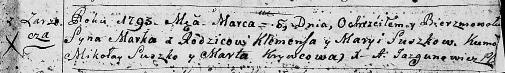

**Сушко Клеменс (Suszko Klementy, Klemiata, Klemens)**

16 октября 1782 г -- крещение сына Филиппа (РГИА 823-2-18, лист 222об,
№8/1782-р (коп)).

10 сентября 1788 г -- крещение сына Захарыя (НИАБ 136-13-894, лист 5,
№47/1788-р (ориг)), (См. тж.: РГИА 823-2-18, лист 236об, №25/1788-р
(коп)).

6 марта 1793 г -- крещение сына Марка (НИАБ 136-13-894, лист 19,
№29/1793-р (ориг)).

19 января 1798 г -- крещение сына Петра (НИАБ 136-13-894, лист 35,
№3/1798-р (ориг)), (РГИА 823-2-18, лист 262, №3/1798-р (коп)).

17 июля 1799 г -- крестный отец у Магдалены Дороты, дочери Сушков Самуся
и Марыи с деревни Горелое (НИАБ 136-13-938, лист 242об, №27/1799-р
(коп)).

**РГИА 823-2-18:** Лист 222об. **Метрическая запись №8/1782-р (коп).**

Дедиловичская Покровская церковь. 16 октября 1782 года. Метрическая
запись о крещении.

Suszko Filip -- сын родителей с деревни Заречье.

Suszko Klementy -- отец.

Suszkowa Marya -- мать.

Suszko Mikołay -- кум.

Tarasionkowa Darya - кума.

Jazgunowicz Antoni -- ксёндз.

**НИАБ 136-13-894:** Лист 5. **Метрическая запись №47/1788-р (ориг).**

Дедиловичская Покровская церковь. 10 сентября 1788 года. Метрическая
запись о крещении.

Suszko Zacharyj -- сын родителей с деревни Заречье.

Suszko Kliemiata -- отец.

Suszkowa Maryia -- мать.

Suszko Mikołay - кум.

Suszkowa Daryia - кума.

Jazgunowicz Antoni -- ксёндз.

**РГИА 823-2-18:** Лист 236об. **Метрическая запись №25/1788-р (коп).**

Дедиловичская Покровская церковь. 10 сентября 1788 года. Метрическая
запись о крещении.

Suszko Zacharyasz -- сын родителей с деревни Заречье.

Suszko Klemens -- отец.

Suszkowa Marya -- мать.

Suszko Mikołay -- кум.

Suszkowa Darya - кума.

Jazgunowicz Antoni -- ксёндз.

**НИАБ 136-13-894:** Лист 19. **Метрическая запись №29/1793-р (ориг).**

Дедиловичская Покровская церковь. 6 марта 1793 года. Метрическая запись
о крещении.

Suszko Marko -- сын родителей с деревни Заречье.

Suszko Klemens -- отец.

Suszkowa Maryia -- мать.

Suszko Mikołay - кум.

Krywcowa Anna - кума.

Jazgunowicz Antoni -- ксёндз.

**НИАБ 136-13-894:** Лист 35. **Метрическая запись №3/1798-р (ориг).**

Дедиловичская Покровская церковь. 19 января 1798 года. Метрическая
запись о крещении.

Suszko Piotr -- сын родителей с деревни Заречье.

Suszko Klemiata -- отец.

Suszkowa Maryia -- мать.

Suszko Mikołay - кум.

Krywcowa Taciana - кума.

Jazgunowicz Antoni -- ксёндз.

**РГИА 823-2-18:** Лист 262. **Метрическая запись №3/1798-р (коп).**

Дедиловичская Покровская церковь. 19 января 1798 года. Метрическая
запись о крещении.

Szuszko Piotr -- сын родителей с деревни Заречье.

Szuszko Klemiata -- отец.

Szuszkowa Marija -- мать.

Szuszko Mikołay -- кум.

Krywcowa Tacianna -- кума.

Jazgunowicz Antoni -- ксёндз.

**НИАБ 136-13-938:** Лист 242об. **Метрическая запись №27/1799-р
(коп).**

(См. тж. НИАБ 136-13-894, лист 39, №29/1799-р (ориг); РГИА 823-2-18,
лист 270об, №28/1799-р (коп))

Дедиловичская Покровская церковь. 10 июля 1799 года. Метрическая запись
о крещении.

Suszkowna Dorota Magdalena -- дочь родителей с деревни Горелое.

Suszko Samuś -- отец.

Suszkowa Marya -- мать.

Suszko Klamiata -- кум, с деревни Заречье.

Suszkowa Paraska - кума.

Jazgunowicz Antoni -- ксёндз.
