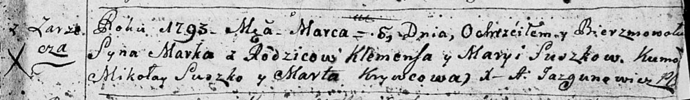

**Сушко Марко Клеменсов (Suszko Marko)**

6 марта 1793 г -- крещение сына Марка (НИАБ 136-13-894, лист 19,
№29/1793-р (ориг)).

**НИАБ 136-13-894:** Лист 19. **Метрическая запись №29/1793-р (ориг).**

{width="6.496527777777778in"
height="0.9440715223097113in"}

Дедиловичская Покровская церковь. 6 марта 1793 года. Метрическая запись
о крещении.

Suszko Marko -- сын родителей с деревни Заречье.

Suszko Klemens -- отец.

Suszkowa Maryia -- мать.

Suszko Mikołay - кум.

Krywcowa Anna - кума.

Jazgunowicz Antoni -- ксёндз.
