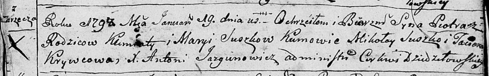
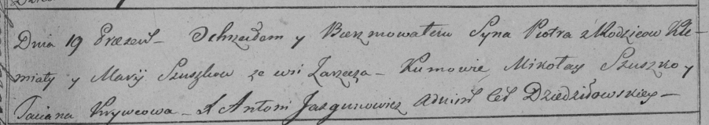

**Сушко Пётр Клеменсов (Suszko Piotr)**

19 января 1798 г -- крещение (НИАБ 136-13-894, лист 35, №3/1798-р
(ориг)), (РГИА 823-2-18, лист 262, №3/1798-р (коп)).

**НИАБ 136-13-894:** Лист 35. **Метрическая запись №3/1798-р (ориг).**

Дедиловичская Покровская церковь. 19 января 1798 года. Метрическая
запись о крещении.

Suszko Piotr -- сын родителей с деревни Заречье.

Suszko Klemiata -- отец.

Suszkowa Maryia -- мать.

Suszko Mikołay - кум.

Krywcowa Taciana - кума.

Jazgunowicz Antoni -- ксёндз.

**РГИА 823-2-18:** Лист 262. **Метрическая запись №3/1798-р (коп).**

Дедиловичская Покровская церковь. 19 января 1798 года. Метрическая
запись о крещении.

Szuszko Piotr -- сын родителей с деревни Заречье.

Szuszko Klemiata -- отец.

Szuszkowa Marija -- мать.

Szuszko Mikołay -- кум.

Krywcowa Tacianna -- кума.

Jazgunowicz Antoni -- ксёндз.
